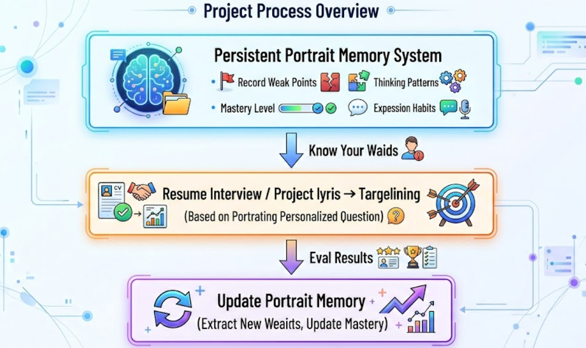

# MemCoach - AI Interview Coach System

MemCoach is an AI interview training platform for software engineering candidates. It combines resume-driven mock interviews, GitHub project analysis, and a persistent profile memory system that keeps learning your weak points, strengths, and communication patterns over time.

[Chinese Version](README.md)

---

## Project Showcase


---

## Project Flow Overview



## Core Features

### Three AI Intelligence Loops

**1. Project Analysis Workflow**

Transform GitHub repositories into personalized interview material automatically. After connecting GitHub, selecting a repository, and defining your ownership scope, the system performs repository parsing, key-file filtering, structural analysis, question generation, and project breakdown reporting.

- GitHub OAuth secure connection (JWT state token + auto-refresh)
- Intelligent file filtering (source code / config / documentation)
- 5 core questions (module boundaries, design decisions, troubleshooting, tech stack, refactoring)
- Evidence-driven questions with source code references
- One-click conversion to focused training

**2. Resume Interview Agent**

Complete interview flow powered by a LangGraph state machine. After reading your resume, the AI simulates realistic interviewer behavior and dynamically adjusts follow-up strategies around experience, projects, and technical depth.

- Five-phase progression: greeting -> self-introduction -> technical -> project deep-dive -> Q&A
- Inline evaluation-driven: advance quickly for good answers, dig deeper for weak ones
- Four-dimension scoring: technical depth / project articulation / communication / problem solving

**3. Profile Memory System (Mem0-Style)**

Persistent user capability profile. After each training session, it automatically extracts weak points, evaluates mastery levels, and records thinking patterns and communication habits -- evolving continuously across sessions.

- Two-phase update: LLM extraction -> ADD/UPDATE/IMPROVE intelligent decisions
- Vector semantic deduplication (cosine similarity >= 0.75)
- Deterministic mastery algorithm

### Adaptive Learning Engine

**Three-Layer Context Fusion for Question Generation**

- Layer 1: Session context (knowledge base retrieval + FAQ + history deduplication)
- Layer 2: Topic profile (mastery 0-100 + historical weak points)
- Layer 3: Global profile (cross-domain traits + communication style)

**SM-2 Spaced Repetition Algorithm**

- Correct answer -> interval extends (1 day -> 3 days -> 7 days -> 14 days...)
- Wrong answer -> interval resets to 1 day
- Due weak points prioritized for questions, scientific review scheduling

### Other Features

- **Recording Review**: Upload recording or paste text, AI auto-transcribes and analyzes (Dual/Solo dual-track mode)
- **Knowledge Base Management**: Maintain core knowledge documents and FAQ banks by domain, Markdown editing supported
- **Multi-User Isolation**: JWT authentication, complete data isolation per user

### Roadmap

**1. Project Interview Agent Mode**

Today, project analysis is closer to an analysis workflow plus report generation. The next major step is to turn it into a true project interview agent:

- keep the current "project breakdown + 5 core questions" mode as the static analysis entry
- add a dedicated "Project Interview Agent" mode that uses repository context and source evidence for multi-turn interviews
- move beyond a fixed Q&A list and adapt follow-up direction based on the candidate's answers
- evaluate project ownership, architecture trade-offs, troubleshooting ability, performance thinking, and security boundaries
- feed the evaluation back into the memory/profile system, forming a new loop: project analysis -> project interview -> profile update

Once implemented, this module would move much closer to a true agent rather than a report pipeline.

**2. Private GitHub Repository Analysis**

Support for private GitHub repositories is also planned. It is technically feasible, but it raises the security and compliance bar significantly:

- access must be controlled through GitHub App / OAuth tokens with least privilege
- allowed repositories, branches, and directories must be explicitly scoped
- temporary code copies need strict lifecycle management rather than long-term persistence
- logs, error traces, and caches must not leak private source content
- a commercial version should additionally include audit logs, permission management, user-side revocation, and data deletion workflows

So private repository analysis is not something we cannot do. It is something we should do only after tightening the security boundary.

---

## Architecture

### Tech Stack

| Layer | Technology |
|-------|------------|
| Backend | FastAPI, LangChain, LangGraph, LlamaIndex |
| Frontend | React 19, React Router v7, Vite, Tailwind CSS v4 |
| Database | SQLite + aiosqlite (async) |
| Vector Storage | bge-m3 embeddings (1024 dimensions) |
| Auth | JWT + bcrypt |
| LLM | Any OpenAI-compatible endpoint |

### Core Modules

```
backend/
├── main.py                    # FastAPI entry, 50+ API routes
├── memory.py                  # Profile engine (Mem0-style)
├── vector_memory.py           # Vector memory (SQLite + bge-m3)
├── indexer.py                # Knowledge indexing (LlamaIndex)
├── spaced_repetition.py       # SM-2 spaced repetition
├── github_connection.py       # GitHub OAuth
├── project_analysis/           # Project Analysis Workflow
│   ├── pipeline.py            # Task orchestration
│   ├── github_source.py       # GitHub API
│   ├── filtering.py           # File filtering
│   └── repo_selection.py      # Repository selection
├── graphs/
│   ├── resume_interview.py    # Resume interview (LangGraph)
│   └── topic_drill.py        # Focused training
└── storage/
    ├── sessions.py            # Session persistence
    └── project_analyses.py    # Project analysis persistence
```

---

## Quick Start

### 1. Configuration

```bash
cp .env.example .env
```

Edit `.env` with your LLM API credentials:

```env
# LLM Configuration (any OpenAI-compatible endpoint)
API_BASE=https://your-llm-api-base/v1
API_KEY=sk-your-api-key
MODEL=your-model-name

# Embeddings default to SiliconFlow BAAI/bge-m3
# Docs:
# https://docs.siliconflow.cn/cn/api-reference/chat-completions/chat-completions
# https://docs.siliconflow.cn/cn/api-reference/embeddings/create-embeddings
EMBEDDING_API_BASE=https://api.siliconflow.cn/v1
EMBEDDING_API_KEY=
EMBEDDING_MODEL=BAAI/bge-m3

# GitHub OAuth (required for Project Analysis)
GITHUB_APP_CLIENT_ID=
GITHUB_APP_CLIENT_SECRET=
GITHUB_OAUTH_STATE_SECRET=

# Auth Configuration
JWT_SECRET=change-me-in-production
DEFAULT_EMAIL=
DEFAULT_PASSWORD=
ALLOW_REGISTRATION=true
REGISTRATION_ACCESS_CODE=xuhaochen
```

### 2. Docker (Recommended)

```bash
docker compose up --build
```

Visit `http://localhost`.

### 3. Manual Setup

```bash
# Backend
pip install -r requirements.txt
uvicorn backend.main:app --reload --port 8000

# Frontend
cd frontend && npm install && npm run dev
```

Visit `http://localhost:5173`.

### 4. Zeabur Deployment (Recommended for Production)

This repository now includes Zeabur-specific deployment entrypoints while keeping the original local Docker files:

- Backend: `Dockerfile.backend`
- Frontend: `Dockerfile.frontend`

Recommended setup:

1. Create a `backend` service in Zeabur using `Dockerfile.backend`
2. Mount a persistent volume to `/app/data`
3. Create a `frontend` service in Zeabur using `Dockerfile.frontend`
4. Set `API_UPSTREAM=<backend private hostname>:8000` on the frontend service

If you want to preserve existing local accounts and history, including `xuhaochen0212@qq.com`, you must import the following into the mounted backend volume:

- `data/interviews.db`
- `data/users/`

See:

- `deploy/zeabur/README.md`
- `deploy/zeabur/backend.env.example`
- `deploy/zeabur/frontend.env.example`
- `deploy/zeabur/AI_PROMPT.zh-CN.md`

### 5. Vercel Deployment Note

Full-stack Vercel deployment is **not recommended** for the current architecture.

The issue is not FastAPI support itself. The actual blocker is that this project depends on:

- local SQLite persistence: `data/interviews.db`
- local persistent user files: `data/users/`

According to Vercel's official runtime docs, Vercel Functions use a read-only filesystem with only writable `/tmp` scratch space, which is not suitable for this project's persistence model.

If you only want to deploy the frontend to Vercel, that is still feasible:

- deploy the frontend to Vercel
- keep the backend on Zeabur or another platform with persistent storage
- then point frontend requests to your backend public URL

For the current architecture, I intentionally do not provide a misleading "full-stack Vercel" tutorial.

---

## Project Structure

```
MemCoach/
├── backend/
│   ├── main.py                 # FastAPI entry
│   ├── auth.py                 # JWT authentication
│   ├── memory.py               # Profile engine
│   ├── vector_memory.py        # Vector memory
│   ├── indexer.py              # Knowledge indexing
│   ├── spaced_repetition.py    # SM-2 algorithm
│   ├── github_connection.py     # GitHub OAuth
│   ├── project_analysis/        # Project Analysis Agent
│   ├── graphs/                  # LangGraph state machines
│   ├── prompts/                 # System prompts
│   └── storage/                # SQLite persistence
├── frontend/
│   └── src/
│       ├── App.jsx             # Routing
│       ├── contexts/            # React Context
│       ├── components/          # Shared components
│       ├── pages/               # Page components
│       └── api/                # API clients
├── data/users/{user_id}/       # User data isolation
│   ├── profile/               # User profile
│   ├── resume/                # Resume files
│   ├── knowledge/              # Domain knowledge base
│   └── topics.json             # Topic configuration
├── docker-compose.yml
├── .env.example
└── requirements.txt
```

---

## License

MIT
