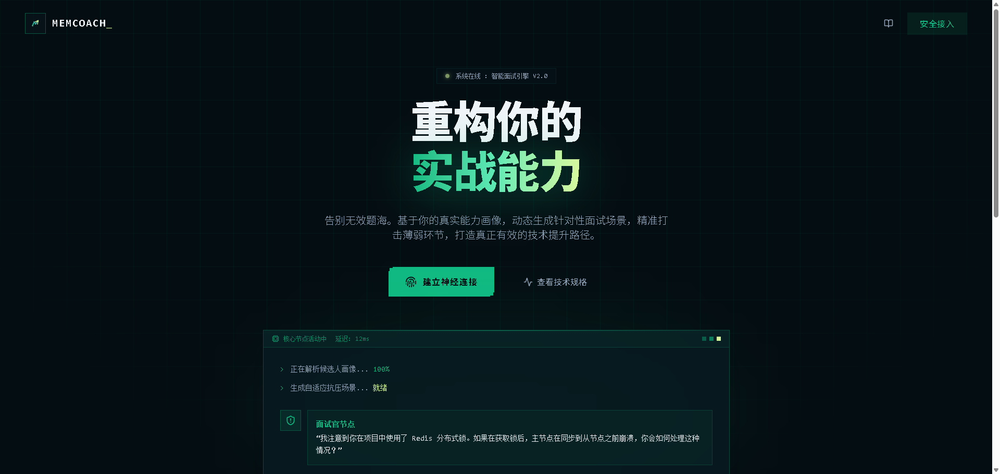
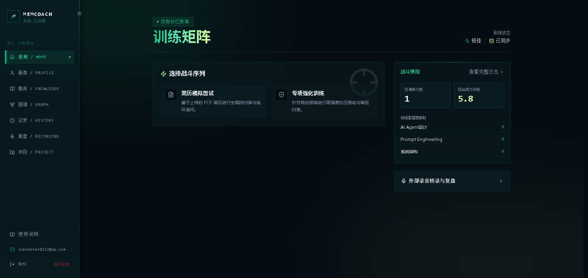
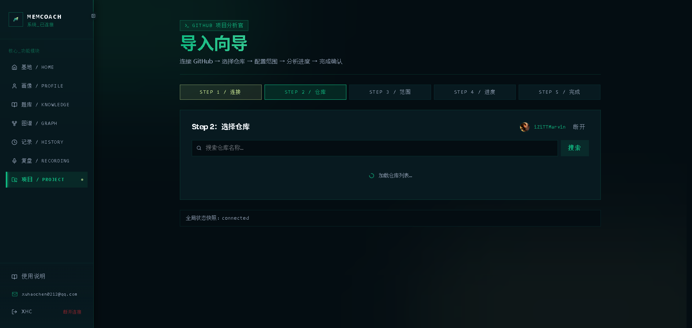
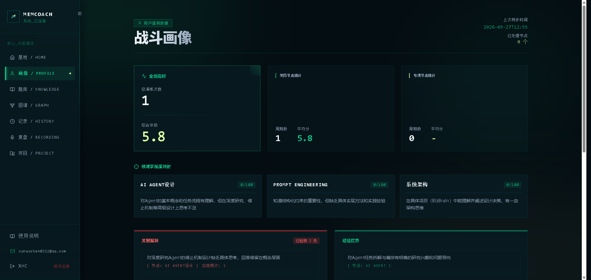
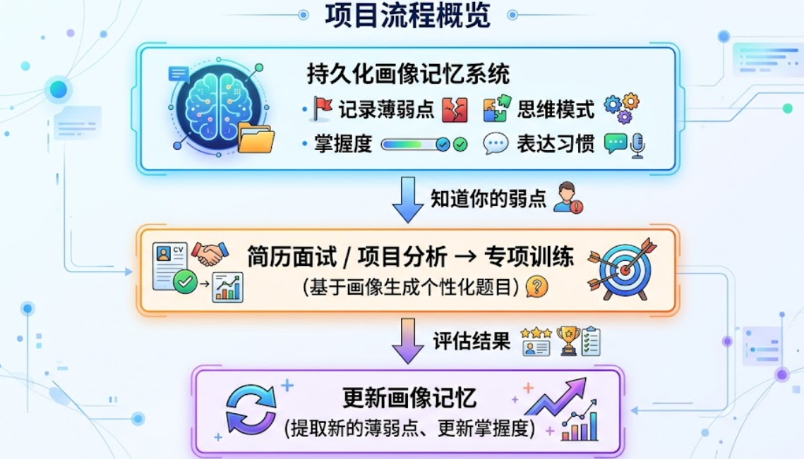

# MemCoach - AI 面试教练系统

MemCoach 是一个面向技术求职者的 AI 面试训练平台：把简历面试、GitHub 项目分析和持久化画像记忆串成一个持续迭代的训练闭环，帮助你从“会背题”走向“会表达、会拆解、会应对追问”。


[English Version](README.en.md)

---

## 项目展示









---

## 项目流程概览



## 核心功能

### 三大 AI 智能闭环

**1. 项目分析工作流**

将 GitHub 仓库自动转化为个性化面试素材。连接 GitHub、选择仓库、配置负责范围后，系统会完成仓库解析、关键文件过滤、结构分析、问题生成与项目拆解报告输出。

- GitHub OAuth 安全连接（JWT state token + 自动刷新）
- 仓库智能过滤（源码/配置/文档）
- 5 道核心问题生成（模块边界、设计决策、故障排查、技术选型、重构）
- 源码证据驱动，每道问题可查看原始代码
- 一键转为专项训练

**2. 简历面试 Agent**

基于 LangGraph 状态机的完整面试流程。AI 读取简历后，模拟真实面试官行为，围绕经历、项目与技术细节动态调整追问策略。

- 五阶段递进：开场问候 -> 自我介绍 -> 技术问题 -> 项目深挖 -> 反问
- 内联评估驱动，答得好快速推进，答得差深入追问
- 四维评分：技术深度 / 项目表达 / 沟通能力 / 问题解决

**3. 画像记忆系统（Mem0 风格）**

持久化的用户能力画像。每次训练后自动提取薄弱点、评估掌握度、记录思维模式与表达习惯，跨会话持续演进。

- 两阶段更新：LLM 提取 -> ADD/UPDATE/IMPROVE 智能决策
- 向量语义去重（cosine similarity >= 0.75）
- 确定性掌握度算法

### 自适应学习引擎

**三层上下文融合出题**

- Layer 1：会话上下文（知识库检索 + FAQ + 历史去重）
- Layer 2：领域画像（掌握度 0-100 + 历史薄弱点）
- Layer 3：全局画像（跨领域特征 + 沟通风格）

**SM-2 间隔重复算法**

- 答对 -> 间隔拉长（1天 -> 3天 -> 7天 -> 14天...）
- 答错 -> 间隔重置为 1 天
- 到期薄弱点优先出题，科学复习调度

### 其他功能

- **录音复盘**：上传录音或粘贴文字，AI 自动转写分析（Dual/Solo 双轨模式）
- **知识库管理**：按领域维护核心知识文档和高频题库，支持 Markdown 编辑
- **多用户隔离**：JWT 认证，数据按用户完全隔离

### 未来计划

**1. 项目面试 Agent 模式**

当前项目分析更接近“分析工作流 + 报告生成”。下一阶段计划在此基础上新增真正的项目面试 Agent：

- 保留现有“项目拆解报告 + 5 道核心问题”模式，作为静态分析入口
- 新增“项目面试 Agent”模式，围绕仓库上下文与源码证据发起多轮追问
- 不再只停留在问答列表，而是根据候选人的回答动态切换追问方向
- 对项目职责、架构取舍、故障排查、性能优化、安全边界做真实面试式考察
- 评估结果回流到画像系统，形成“项目分析 -> 项目面试 -> 画像更新”的新闭环

如果做到这一步，项目分析模块就会从“LLM 驱动的分析工作流”升级为真正具有多轮追问与动态决策能力的 Agent。

**2. 私有 GitHub 仓库分析**

未来也计划支持用户的私有仓库分析。这在技术上完全可行，但会显著提升安全与合规要求：

- 需要基于 GitHub App / OAuth token 的最小权限访问控制
- 必须明确哪些仓库、哪些分支、哪些目录允许被分析
- 临时拉取的代码副本需要严格生命周期管理，避免长期落盘
- 日志、错误信息、缓存都不能泄露私有代码内容
- 商业化后应补充审计日志、权限管理、用户侧撤销授权与数据删除能力

因此，私有仓库分析不是“不能做”，而是“可以做，但必须在安全边界收紧之后再做”。

---

## 技术架构

### 技术栈

| 层级 | 技术选型 |
|------|---------|
| 后端框架 | FastAPI, LangChain, LangGraph, LlamaIndex |
| 前端框架 | React 19, React Router v7, Vite, Tailwind CSS v4 |
| 数据库 | SQLite + aiosqlite（异步） |
| 向量存储 | bge-m3 embeddings (1024 维) |
| 认证 | JWT + bcrypt |
| LLM | 任何 OpenAI 兼容接口 |

### 核心模块

```
backend/
├── main.py                    # FastAPI 入口，50+ API 路由
├── memory.py                  # 画像引擎（Mem0 风格）
├── vector_memory.py           # 向量记忆（SQLite + bge-m3）
├── indexer.py                # 知识索引（LlamaIndex）
├── spaced_repetition.py       # SM-2 间隔重复调度
├── github_connection.py       # GitHub OAuth 连接
├── project_analysis/           # 项目分析工作流
│   ├── pipeline.py            # 任务编排
│   ├── github_source.py       # GitHub API 接入
│   ├── filtering.py           # 文件过滤
│   └── repo_selection.py      # 仓库选择
├── graphs/
│   ├── resume_interview.py    # 简历面试（LangGraph 状态机）
│   └── topic_drill.py        # 专项训练
└── storage/
    ├── sessions.py            # 会话持久化
    └── project_analyses.py    # 项目分析持久化
```

---

## 快速开始

### 1. 环境配置

```bash
cp .env.example .env
```

编辑 `.env`：

```env
# LLM 配置（支持任何 OpenAI 兼容接口）
API_BASE=https://your-llm-api-base/v1
API_KEY=sk-your-api-key
MODEL=your-model-name

# 嵌入模型默认使用硅基流动 SiliconFlow 的 BAAI/bge-m3
# 文档：
# https://docs.siliconflow.cn/cn/api-reference/chat-completions/chat-completions
# https://docs.siliconflow.cn/cn/api-reference/embeddings/create-embeddings
EMBEDDING_API_BASE=https://api.siliconflow.cn/v1
EMBEDDING_API_KEY=
EMBEDDING_MODEL=BAAI/bge-m3

# GitHub OAuth（项目分析功能需要）
GITHUB_APP_CLIENT_ID=
GITHUB_APP_CLIENT_SECRET=
GITHUB_OAUTH_STATE_SECRET=

# 认证配置
JWT_SECRET=change-me-in-production
DEFAULT_EMAIL=
DEFAULT_PASSWORD=
ALLOW_REGISTRATION=true
REGISTRATION_ACCESS_CODE=xuhaochen
```

### 2. Docker 部署（推荐）

```bash
docker compose up --build
```

访问 `http://localhost`。

### 3. 手动部署

```bash
# 后端
pip install -r requirements.txt
uvicorn backend.main:app --reload --port 8000

# 前端
cd frontend && npm install && npm run dev
```

访问 `http://localhost:5173`。

### 4. Zeabur 部署（前后端分离，推荐线上方案）

当前仓库已内置 Zeabur 专用部署入口，同时保留本地 Docker 文件：

- 后端：`Dockerfile.backend`
- 前端：`Dockerfile.frontend`

部署建议：

1. 在 Zeabur 创建 `backend` 服务，使用 `Dockerfile.backend`
2. 为 `backend` 挂载持久卷到 `/app/data`
3. 在 Zeabur 创建 `frontend` 服务，使用 `Dockerfile.frontend`
4. 为 `frontend` 设置 `API_UPSTREAM=<backend 私网地址>:8000`

如果你要保留本地已有账号和历史数据，例如 `xuhaochen0212@qq.com`，必须把以下内容导入后端挂载卷：

- `data/interviews.db`
- `data/users/`

更完整的步骤见：

- `deploy/zeabur/README.md`
- `deploy/zeabur/backend.env.example`
- `deploy/zeabur/frontend.env.example`
- `deploy/zeabur/AI_PROMPT.zh-CN.md`

### 5. Vercel 部署说明

当前项目**不建议做全栈 Vercel 部署**。

原因不是 FastAPI 不能跑，而是当前后端依赖：

- 本地 SQLite：`data/interviews.db`
- 本地持久化目录：`data/users/`

而 Vercel Functions 官方运行时是**只读文件系统**，只有最大 500 MB 的可写 `/tmp` 临时空间，不适合作为本项目的持久化存储层。

如果你只想把前端静态页面部署到 Vercel，可以这样做：

- 前端单独上 Vercel
- 后端继续部署在 Zeabur / 其他支持持久卷的服务
- 再把前端请求改成指向你的后端公网地址

在当前架构下，我不建议提供“全栈 Vercel 一键部署教程”，因为那会给出一个表面可部署、但实际上会丢数据的方案。

---

## 目录结构

```
MemCoach/
├── backend/
│   ├── main.py                 # FastAPI 入口
│   ├── auth.py                 # JWT 认证
│   ├── memory.py               # 画像引擎
│   ├── vector_memory.py        # 向量记忆
│   ├── indexer.py              # 知识索引
│   ├── spaced_repetition.py     # SM-2 算法
│   ├── github_connection.py     # GitHub OAuth
│   ├── project_analysis/        # 项目分析 Agent
│   ├── graphs/                 # LangGraph 状态机
│   ├── prompts/                # 系统提示词
│   └── storage/                # SQLite 持久化
├── frontend/
│   └── src/
│       ├── App.jsx             # 路由配置
│       ├── contexts/            # React Context
│       ├── components/          # 共享组件
│       ├── pages/               # 页面组件
│       └── api/                # API 客户端
├── data/users/{user_id}/       # 用户数据隔离
│   ├── profile/               # 用户画像
│   ├── resume/                # 简历文件
│   ├── knowledge/              # 领域知识库
│   └── topics.json             # 领域配置
├── docker-compose.yml
├── .env.example
└── requirements.txt
```

---

## 许可证

MIT
